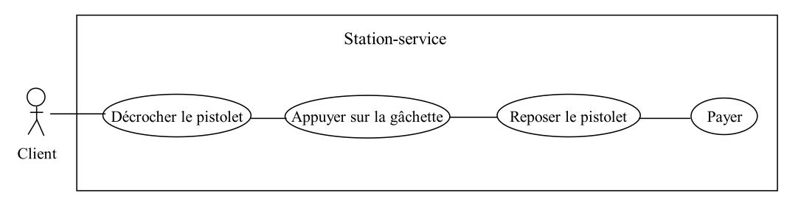

Modéliser avec UML
===

**LUNDI :**
veille sur UML et les diagrammes de classe

- Après avoir vu tous les concepts clés ici, reprendre les exercices sur la Poo et réaliser les diagrammes de classe, d'abord sur feuille, puis dans votre ide ou se.
- Trouver un moyen de générer automatiquement le code java à partir de vos diagrammes de classe et inversement.

**MARDI :**
veille sur les diagrammes de cas d'utilisation

 **Après avoir repérer les acteurs, réaliser les diagrammes de cas d'utilisation pour chaque énoncé :**
- Dans un magasin, un commerçant dispose d’un système de gestion de son stock d’articles, dont les fonctionnalités sont les suivantes :
-> Edition de la fiche d’un fournisseur
-> Possibilité d’ajouter un nouvel article (dans ce cas, la fiche fournisseur est automatiquement éditée. Si le fournisseur n’existe pas, on peut le créer)
-> Edition de l’inventaire. Depuis cet écran, on a le choix d’imprimer l’inventaire, d’effacer un article ou d’éditer la fiche d’un article).

- On considère le système suivant de gestion d’un DAB (Distributeur automatique de billets) :
le distributeur délivre de l’argent à tout porteur de carte (carte Visa ou carte de la banque)
pour les clients de la banque, il permet :
-> la consultation du solde du compte
-> le dépôt d’argent (chèque ou numéraire)
toute transaction est sécurisée et nécessite par conséquent une authentification.
dans le cas où une carte est avalée par le distributeur, un opérateur de maintenance se charge de la récupérer. C’est la même personne qui collecte également les dépôts d’argent et qui recharge le distributeur.

**MERCREDI :**
veille sur les diagrammes d'activité

- Soit un système informatique qui gère une station-service :
    Le client peut utiliser des pompes manuelles et payer à la caisse du gérant ou utiliser des pompes automatiques.
    Le gérant de la station utilise le système informatique pour ses opérations de gestion (particulièrement le bilan des opérations de vente d’essence).
    Le gérant peut se servir de l’essence pour sa voiture.
    La station-service a un petit atelier d’entretien de véhicules. Le gérant est aussi mécanicien.
    **Que pensez-vous du diagramme présenté ci-dessous ?**

 
 
- Décrire la connexion d'un client à un serveur. On considère trois protagonistes : le client, le démon (appli web sur le serveur) et la machine serveur. Une fois la connexion établie entre le client et le serveur, le démon demande un mot de passe au client, ce dernier dispose de trois tentatives avant que la connexion ne soit rompue. Les tentatives infructueuses sont enregistrées dans un fichier sur le serveur. Une fois l'identification faite, un terminal est ouvert et l'utilisateur peut alors saisir des commandes qui sont interprétées par le démon et exécutées sur le serveur. La commande exit déconnecte le client du serveur **-> Réaliser le diagramme d'activité**
- Décrire le fonctionnement d'un distributeur de billets. Le client introduit sa carte dont la validité est immédiatement vérifiée. Il est ensuite invité à saisir le code de la carte. Après trois tentatives infructueuses, la carte est avalée. Sinon le client peut indiquer le montant qu'il désire retirer, le solde de son compte bancaire est alors consulté pour s'assurer que le retrait est possible. En cas de solde insuffisant, le client en est informé et peut alors saisir un montant inférieur. Si le solde du compte est suffisant, le distributeur restitue la carte et délivre alors les billets accompagnés d'un reçu **-> Réaliser le diagramme d'activité**

**JEUDI :**
veille sur les diagrammes de séquence

Katas + Révisions 
- Un produit va être installé pour contrôler N ascenseurs dans un gratte-ciel de M étages. Notre problème concerne la logique nécessaire au déplacement des ascenseurs entre les étages en accord avec les contraintes suivantes:
chaque ascenseur possède un ensemble de M boutons, un pour chaque étage. Un bouton s’allume lorsqu’il est appuyé et provoque le déplacement de l’ascenseur vers l’étage correspondant.
chaque étage, à l’exception du premier et du dernier, possède deux boutons, un pour demander la montée et un pour demander  la descente. Ces boutons s’allument lorsqu’ils sont appuyés. Ils s’éteignent quand l’ascenseur arrive à l’étage, et celui ci se déplace ensuite dans la direction demandée.
quand un ascenseur n’est pas requis, il reste à l’étage où il se trouve et ferme ses portes.
**Décrire à l’aide d’un diagramme de séquence chacun des scénarios suivants:**
    -> requête d’ascenseur depuis l’étage
    -> requête d’étage depuis l’ascenseur

- Le déroulement normal d’utilisation d’un distributeur automatique de billets est le suivant :
    * le client introduit sa carte bancaire
    * la machine vérifie alors la validité de la carte et demande le code au client
    * si le code est correct, elle envoie une demande d’autorisation de prélèvement au groupement de banques. Ce dernier renvoie le solde autorisé à prélever.
    * le distributeur propose alors plusieurs montants à prélever
    * le client saisit le montant à retirer
    * après contrôle du montant par rapport au solde autorisé, le distributeur demande au client s’il désire un ticket
    * Après la réponse du client, la carte est éjectée et récupérée par le client
    * les billets sont alors délivrés (ainsi que le ticket)
    * le client récupère enfin les billets et son ticket
**Modéliser cette situation à l’aide d’un diagramme de séquence en ne prenant en compte que le cas où tout se passe bien. NB : on identifiera les scénarios qui peuvent poser problème en incluant des commentaires dans le diagramme**

- Le déroulement normal d’utilisation d’une caisse de supermarché est le suivant :
    * un client arrive à la caisse avec ses articles à payer
    * le caissier enregistre le numéro d’identification de chaque article, ainsi que la quantité si elle est supérieure à 1
    * la caisse affiche le prix de chaque article et son libellé
    * lorsque tous les achats sont enregistrés, le caissier signale la fin de la vente
    * la caisse affiche le total des achats
    * le caissier annonce au client le montant total à payer
    * le client choisit son mode de paiement
      -> liquide : le caissier encaisse l’argent, la caisse indique le montant à rendre au client
      -> chèque : le caissier note le numéro de pièce d’identité du client
      -> carte de crédit : la demande d’autorisation est envoyée avant la saisie
    * la caisse enregistre la vente et l’imprime
    * le caissier donne le ticket de caisse au client
**Modéliser cette situation à l’aide d’un diagramme de séquence en ne prenant en compte que le cas du paiement en liquide.**

**VENDREDI :**
veille sur les autres diagrammes (état, package, déploiement...)

Intervention d'Aurélie sur l'analyse des besoins

Kahoot sur les diagrammes de classe (quiz)

**Ressources**

[Uml classes Par les exemples](https://fr.slideshare.net/MireilleBF/uml-classes-par-les-exemples)

[UML 2 par la pratique études des cas et exercices corrigés](https://fr.slideshare.net/GMA87/uml-2-par-la-pratique-tudes-des-cas-et-exercices-corrigs)
